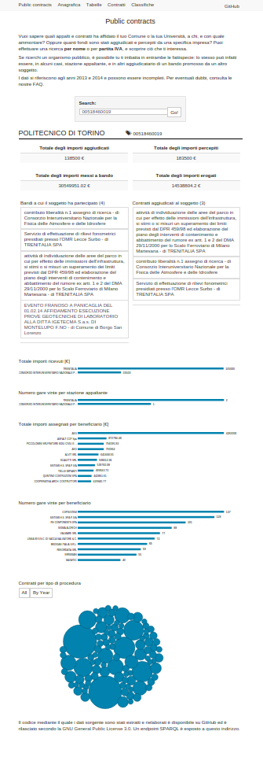

# public-contracts
This project allows you to fetch data from transparency XML files of Italian public contracts, to create an RDF representation of data, and to generate user-friendly visualizations. All in compliance with the Transparency Act, L.190/2012.

## How to clone this repository

Since this repository contains submodules, to clone this you have to
run the following command:

    git clone --recursive https://github.com/nexacenter/public-contracts.git

Otherwise, if you have already cloned, you can fetch the submodules using
the following command:

    git submodule update --init

## Dependencies

